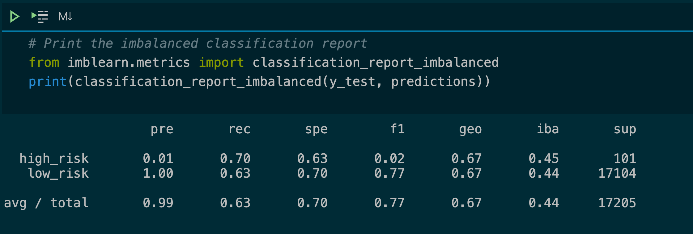
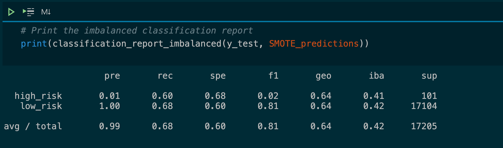
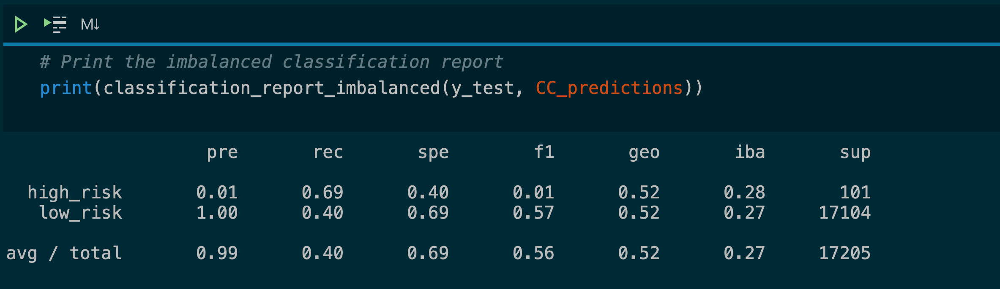
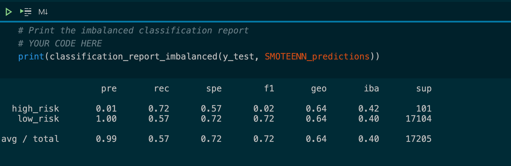
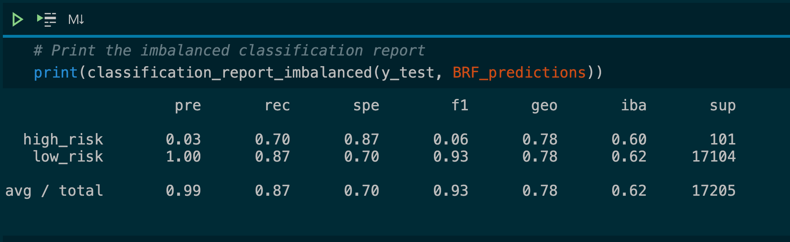
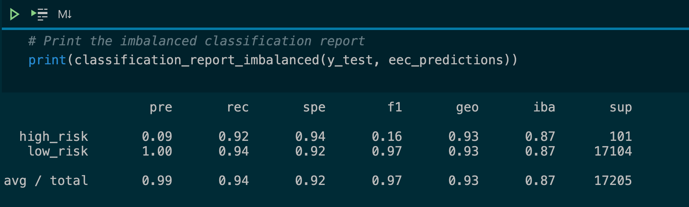

# Credit Risk Analysis

Using data from [Leading Club](https://www.lendingclub.com/info/prospectus.action) that is synthesized from actual loan data. We are looking to predict the credit risk of a new loan with data that has highly imbalanced classes and testing different sampling algorithms (RandomOverSample, SMOTE, ClusterCentroids, and SMOTEEN) and will test on Logistical regression learning models.  In this data, far more people are low risk (68470) versus high risk (347).

To give context and check our performance of the sampling algorithms, we further checked the data against two ensemble models that better deal with the class imbalance for credit card approvals ([Balanced Random Forest](https://imbalanced-learn.org/stable/references/generated/imblearn.ensemble.BalancedRandomForestClassifier.html),  [Easy Ensemble AdaBoost Classifier](https://scikit-learn.org/stable/modules/generated/sklearn.ensemble.AdaBoostClassifier.html))

## Overview of the Analysis

## Analysis 

### Base Performance of Logistical Regression

#### [Jupyter notebook for base logistical regression](./credit_risk_base_logistical.ipynb)

With no over or under-sampling, we have a base balanced accuracy of 0.50 with our recall being 0.01.  Our base model does predict the actual high-risk cases well at all.

### Sampling Algorithms

#### ([ See the raw Jupyter notebook for Sampling Algorithms](credit_risk_resampling.ipynb))

We performed an analysis of different sampling techniques with the Logistic Regression model to improve the effectiveness of models in determining the credit risk. We are using the Balanced Accuracy score (TPR+TNR/2 ) as it works better for imbalanced classes.

The following were the sampling methods we used with the results:

#### RandomOverSampler (Oversampling ) 

On this data, the RandomOverSampler data produces a logistical regression model with a balanced accuracy score of 0.666, but as we can see this gives us terrible precision for high risk (0.01) and is far more precise (1.0 ) at predicting who is low risk after the random over-sampling is applied.   For high-risk applications, our model will calculate a tremendous amount of false positives meaning many of the high-risk applications are not.

#### SMOTE (Oversampling Technique) 

With SMOTE, the resampled data using SMOTE, produces a logistical regression model with a balanced accuracy score of 0.642, but still produces terrible precision for high-risk(0.01) and is still more precise with low-risk applications(1.0) after the SMOTE was applied.   For high-risk applications, our model will calculate a tremendous amount of false positives meaning many of the high-risk applications are actually not high-risk at all.

#### ClusterCentroids ( Undersampling ) 

Similarly, the undersampling ClusterCentroids algorithm produces similar precision results ( 0.01 for high risk, and 1.0 for low risk) with a balanced accuracy score of 0.544.

#### SMOTEENN ( Under and Over Sampling Combination)

The data ran through the SMOTEEN over/undersampling resulted in balanced accuracy score of 0.644, but similiar results for precision ( ( 0.01 for high risk, and 1.0 for low risk))

### Ensembling Algorithms

#### [Jupyter notebook for Ensempling Algorithms](./credit_risk_ensemble.ipynb)

The following were the sampling methods we used with the results:

#### Balanced Random Forest

While the balanced Random forest produced a relatively low precision (0.03), meaning we are still often wrong about who is a high risk, our balanced accuracy score was 0.7885466545953005.  

#### Easy Ensemble AdaBoost Classifier

While the Easy Ensemble AdaBoost produced a relatively low precision (0.09), meaning we are still often wrong about who is a high risk, our balanced accuracy score was 0.9316600714093861.  

# Analysis and Conclusions
We tried several models with different over and sampling methods.  None of the models were usable with low .01 precision on all tools and Recall of less than .75 on all models for high-risk judgments.  While the overall accuracy score using the resampling techniques was above 0.50 and edging past the 0.6 mark, the models produced from the resampled data were all much more correctly predicting a low-risk credit application than getting a high-risk credit application assessed correctly.  

Still, using the resampling methods did improve the overall accuracy of this data set in working logistical models with RandomOverSampler showing the best improvement.

Typically, the tree ensemble methods just were a better fit and created models with higher accuracy then resampled data with logistical regression with the Easy Ensemble AdaBoost Classifier having a balanced accuracy score of 0.9316600714093861, which was a 40% improvement from a base logistical regression.  Even with these models, we had a high degree of false positives for high risk applications.